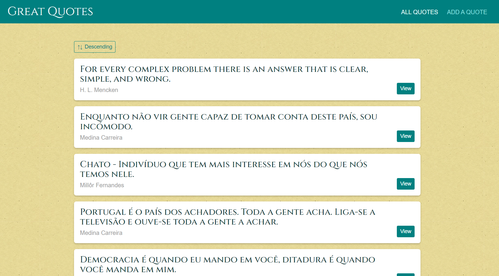
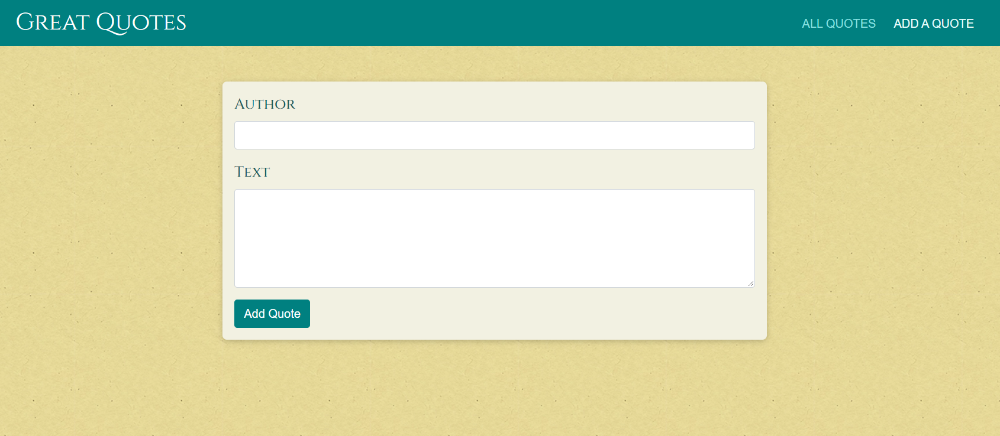
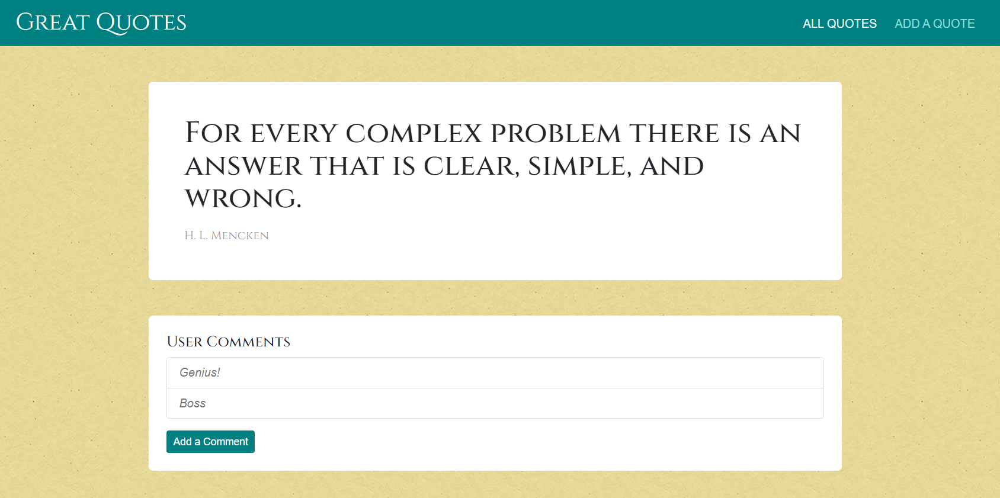

# Section 20: Routing
https://www.udemy.com/course/react-the-complete-guide-incl-redux/

## Preview Ex 1
Used Bulma for styles.

## Preview Ex 2
Routing, forms and backend with Firebase

### Deployment
After Section 21 it's deployed in Firebase:
https://react-udemy-quotes.web.app/quotes